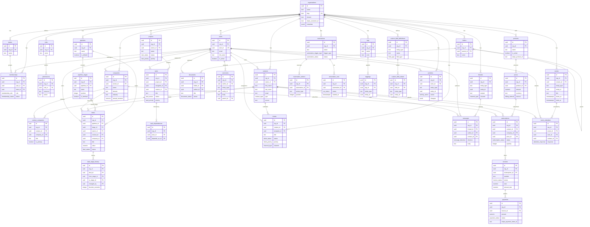

# Schema Diagram

Full ER diagram of the Skene DB schema, grouped by module.

```mermaid
erDiagram
    %% =========================================
    %% IDENTITY MODULE
    %% =========================================

    organizations {
        uuid id PK
        text name
        text slug UK
        text domain
        text stripe_customer_id
        jsonb metadata
    }

    users {
        uuid id PK
        uuid org_id FK
        uuid auth_id UK
        text email
        text full_name
        boolean is_active
    }

    teams {
        uuid id PK
        uuid org_id FK
        text name
    }

    memberships {
        uuid id PK
        uuid org_id FK
        uuid user_id FK
        uuid team_id FK
        membership_role role
        membership_status status
    }

    roles {
        uuid id PK
        uuid org_id FK
        text name
    }

    permissions {
        uuid id PK
        uuid org_id FK
        uuid role_id FK
        text resource
        text action
    }

    organizations ||--o{ users : "has"
    organizations ||--o{ teams : "has"
    organizations ||--o{ memberships : "has"
    users ||--o{ memberships : "belongs to"
    teams ||--o{ memberships : "groups"
    organizations ||--o{ roles : "defines"
    roles ||--o{ permissions : "grants"

    %% =========================================
    %% CRM MODULE
    %% =========================================

    contacts {
        uuid id PK
        uuid org_id FK
        uuid owner_id FK
        text first_name
        text last_name
        text email
        contact_type type
        text source
    }

    companies {
        uuid id PK
        uuid org_id FK
        uuid owner_id FK
        text name
        text domain
        text industry
        numeric annual_revenue
    }

    contact_companies {
        uuid id PK
        uuid org_id FK
        uuid contact_id FK
        uuid company_id FK
        text title
        boolean is_primary
    }

    organizations ||--o{ contacts : "has"
    organizations ||--o{ companies : "has"
    users ||--o{ contacts : "owns"
    users ||--o{ companies : "owns"
    contacts ||--o{ contact_companies : "works at"
    companies ||--o{ contact_companies : "employs"

    %% =========================================
    %% PIPELINE MODULE
    %% =========================================

    pipelines {
        uuid id PK
        uuid org_id FK
        text name
        boolean is_default
    }

    pipeline_stages {
        uuid id PK
        uuid org_id FK
        uuid pipeline_id FK
        text name
        integer position
        boolean is_terminal
    }

    deals {
        uuid id PK
        uuid org_id FK
        uuid pipeline_id FK
        uuid stage_id FK
        uuid owner_id FK
        uuid contact_id FK
        uuid company_id FK
        text title
        numeric value
        deal_status status
    }

    deal_stage_history {
        uuid id PK
        uuid org_id FK
        uuid deal_id FK
        uuid from_stage_id FK
        uuid to_stage_id FK
        uuid changed_by FK
        integer duration_seconds
    }

    organizations ||--o{ pipelines : "has"
    pipelines ||--o{ pipeline_stages : "contains"
    pipelines ||--o{ deals : "tracks"
    pipeline_stages ||--o{ deals : "current stage"
    deals ||--o{ deal_stage_history : "history"
    contacts ||--o{ deals : "associated"
    companies ||--o{ deals : "associated"
    users ||--o{ deals : "owns"

    %% =========================================
    %% TASKS MODULE
    %% =========================================

    projects {
        uuid id PK
        uuid org_id FK
        uuid owner_id FK
        text name
        task_status status
        task_priority priority
    }

    tasks {
        uuid id PK
        uuid org_id FK
        uuid project_id FK
        uuid assignee_id FK
        uuid creator_id FK
        text title
        task_status status
        task_priority priority
    }

    task_dependencies {
        uuid id PK
        uuid org_id FK
        uuid task_id FK
        uuid depends_on_id FK
    }

    organizations ||--o{ projects : "has"
    projects ||--o{ tasks : "contains"
    users ||--o{ tasks : "assigned to"
    tasks ||--o{ task_dependencies : "blocked by"

    %% =========================================
    %% SUPPORT MODULE
    %% =========================================

    tickets {
        uuid id PK
        uuid org_id FK
        uuid contact_id FK
        uuid assignee_id FK
        text title
        ticket_status status
        ticket_priority priority
        channel_type channel
    }

    organizations ||--o{ tickets : "has"
    contacts ||--o{ tickets : "submitted"
    users ||--o{ tickets : "assigned to"

    %% =========================================
    %% COMMS MODULE
    %% =========================================

    threads {
        uuid id PK
        uuid org_id FK
        text entity_type
        uuid entity_id
        text subject
        channel_type channel
    }

    messages {
        uuid id PK
        uuid org_id FK
        uuid thread_id FK
        uuid author_id FK
        uuid contact_id FK
        message_direction direction
        text body
    }

    organizations ||--o{ threads : "has"
    threads ||--o{ messages : "contains"
    users ||--o{ messages : "authored"
    contacts ||--o{ messages : "sent"

    %% =========================================
    %% CONTENT MODULE
    %% =========================================

    folders {
        uuid id PK
        uuid org_id FK
        uuid parent_id FK
        text name
    }

    documents {
        uuid id PK
        uuid org_id FK
        uuid folder_id FK
        uuid author_id FK
        text title
        document_status status
    }

    comments {
        uuid id PK
        uuid org_id FK
        uuid author_id FK
        text entity_type
        uuid entity_id
        text body
        uuid parent_id FK
    }

    organizations ||--o{ folders : "has"
    folders ||--o{ folders : "parent"
    folders ||--o{ documents : "contains"
    users ||--o{ documents : "authored"
    users ||--o{ comments : "authored"

    %% =========================================
    %% BILLING MODULE
    %% =========================================

    products {
        uuid id PK
        uuid org_id FK
        text name
        boolean is_active
        text stripe_product_id
    }

    prices {
        uuid id PK
        uuid org_id FK
        uuid product_id FK
        numeric amount
        text currency
        billing_interval interval
    }

    subscriptions {
        uuid id PK
        uuid org_id FK
        uuid contact_id FK
        uuid company_id FK
        uuid price_id FK
        subscription_status status
        integer quantity
    }

    invoices {
        uuid id PK
        uuid org_id FK
        uuid subscription_id FK
        text number
        invoice_status status
        numeric total
        numeric amount_due
    }

    payments {
        uuid id PK
        uuid org_id FK
        uuid invoice_id FK
        numeric amount
        payment_status status
        text stripe_payment_intent_id
    }

    organizations ||--o{ products : "sells"
    products ||--o{ prices : "priced at"
    prices ||--o{ subscriptions : "subscribed"
    contacts ||--o{ subscriptions : "subscribes"
    companies ||--o{ subscriptions : "subscribes"
    subscriptions ||--o{ invoices : "billed"
    invoices ||--o{ payments : "paid by"

    %% =========================================
    %% CALENDAR MODULE
    %% =========================================

    events {
        uuid id PK
        uuid org_id FK
        uuid creator_id FK
        text entity_type
        uuid entity_id
        text title
        timestamptz starts_at
        timestamptz ends_at
    }

    event_attendees {
        uuid id PK
        uuid org_id FK
        uuid event_id FK
        uuid user_id FK
        uuid contact_id FK
        attendee_response response
    }

    organizations ||--o{ events : "has"
    events ||--o{ event_attendees : "attended by"
    users ||--o{ event_attendees : "attends"
    contacts ||--o{ event_attendees : "attends"

    %% =========================================
    %% AUTOMATIONS MODULE
    %% =========================================

    automations {
        uuid id PK
        uuid org_id FK
        text name
        automation_trigger_type trigger_type
        automation_status status
    }

    automation_actions {
        uuid id PK
        uuid org_id FK
        uuid automation_id FK
        text action_type
        integer position
    }

    automation_runs {
        uuid id PK
        uuid org_id FK
        uuid automation_id FK
        run_status status
        timestamptz started_at
    }

    organizations ||--o{ automations : "has"
    automations ||--o{ automation_actions : "executes"
    automations ||--o{ automation_runs : "ran"

    %% =========================================
    %% FLEXIBLE DATA MODULE
    %% =========================================

    tags {
        uuid id PK
        uuid org_id FK
        text name
        text color
    }

    taggings {
        uuid id PK
        uuid org_id FK
        uuid tag_id FK
        text entity_type
        uuid entity_id
    }

    custom_field_definitions {
        uuid id PK
        uuid org_id FK
        text entity_type
        text name
        field_type field_type
    }

    custom_field_values {
        uuid id PK
        uuid org_id FK
        uuid field_id FK
        text entity_type
        uuid entity_id
    }

    organizations ||--o{ tags : "has"
    tags ||--o{ taggings : "applied"
    organizations ||--o{ custom_field_definitions : "defines"
    custom_field_definitions ||--o{ custom_field_values : "values"

    %% =========================================
    %% ACTIVITY MODULE
    %% =========================================

    activities {
        uuid id PK
        uuid org_id FK
        uuid actor_id FK
        text entity_type
        uuid entity_id
        activity_action action
        jsonb changes
    }

    organizations ||--o{ activities : "has"
    users ||--o{ activities : "performed"
```
